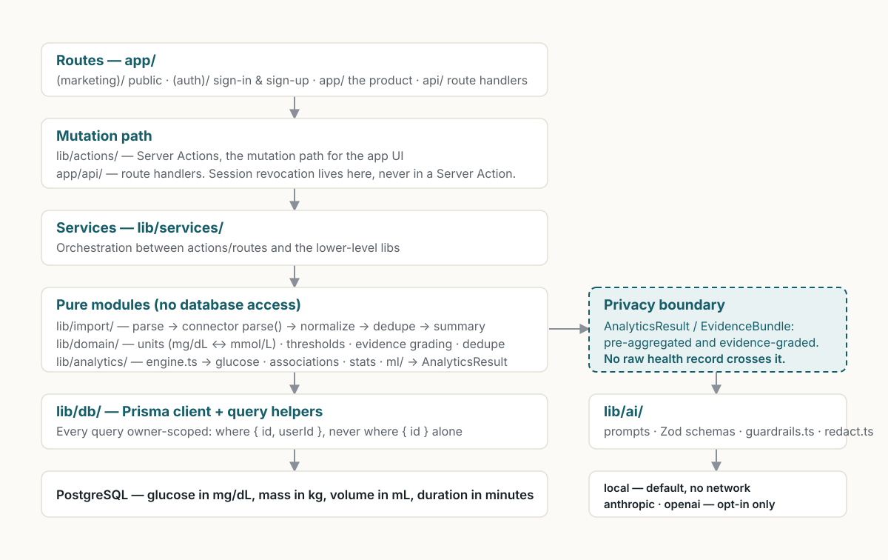

# DiaLog

[](https://github.com/alexou8/DiaLog/actions/workflows/ci.yml)
[](LICENSE)

**A personal glucose record that tells you what your own data actually
supports — and says "not enough data yet" when it doesn't.**

Log or import your readings, meals, activity and sleep; DiaLog grades every
pattern it finds by how much of your history backs it, and explains it in plain
language. Built accessibility-first, for people aged 20 to 80.


- **Evidence-graded analytics** — every finding carries the sample size behind
  it, and thin data is reported as thin rather than rounded up into a claim.
- **A privacy boundary in code** — the AI layer never receives a raw health
  record, only a pre-aggregated evidence bundle.
- **Imports that survive real files** — six vendor connectors plus three
  generic fallbacks, preview-then-commit, and content-addressed deduplication
  that makes re-importing the same export a no-op.
- **Accessibility as a test, not a promise** — `@axe-core/playwright` runs over
  twelve public and authenticated routes on every CI run, and every chart ships
  a real `<table>` alternative.

> **DiaLog is not a medical device.** It does not diagnose any condition, does
> not recommend or adjust medication doses, and does not replace a healthcare
> provider. Every pattern it surfaces is graded by how much of your own data
> supports it, and it says "not enough data yet" when that is the honest
> answer. See [Medical disclaimer](#medical-disclaimer).

## Why this project is technically interesting



Four constraints shaped most of the code, and each is enforced somewhere you
can go and read:

- **An AI feature that cannot leak health data.** `lib/ai/` is only ever handed
  an `AnalyticsResult` / `EvidenceBundle` — pre-aggregated and evidence-graded.
  Raw records never cross that line, so the local provider and an external one
  see exactly the same shape of input.
- **A safety filter that is deliberately over-eager.** The medical-safety
  regexes in `lib/ai/guardrails.ts` over-match on purpose: a false rejection
  falls back to a safe template, a false negative is a dosing instruction
  reaching a patient. That asymmetry is written into the tests.
- **Session revocation you cannot accidentally undo.** Bumping
  `User.tokenVersion` is what kills outstanding cookies, and it can only happen
  in a route handler — `tests/unit/auth/session-revocation.test.ts` fails the
  build if a Server Action ever writes that column. The rule exists because an
  earlier version produced an infinite redirect loop that locked out exactly
  the users who had just revoked their sessions.
- **Imports that are idempotent by construction.** A `dedupeKey` derived from
  the record's content means re-importing the same export is a no-op, and every
  unparseable row produces a `RowIssue` rather than being silently dropped.

Full reasoning, including the alternatives rejected:
[docs/ARCHITECTURE.md](docs/ARCHITECTURE.md) and
[docs/CASE_STUDY.md](docs/CASE_STUDY.md).

## Evidence

| Area          | Where to verify it                                                                                                                      |
| ------------- | --------------------------------------------------------------------------------------------------------------------------------------- |
| Security      | `tests/integration/authorization.test.ts`, `api-security.test.ts`, `auth-credential-routes.test.ts`; threat model in `docs/SECURITY.md` |
| Accessibility | `tests/e2e/accessibility.spec.ts` runs axe over twelve routes; `docs/ACCESSIBILITY.md` lists the known gaps                             |
| Reliability   | Import idempotency and malformed-file handling in `tests/unit/import/`; `/api/health` readiness endpoint                                |
| Data safety   | Export and deletion lifecycle in `lib/actions/preferences.ts`; per-model deletion decisions in `docs/DATA.md`                           |
| AI safety     | `tests/unit/ai/` covers the evidence-bundle boundary, schema validation and the dosing/diagnosis guardrails                             |

<details>
<summary><strong>More screenshots</strong> — logging, insights, reports, import, settings, dark theme and mobile</summary>

|                                                               |                                                            |
| ------------------------------------------------------------- | ---------------------------------------------------------- |
|                  |                |
|                   |          |
|                     |                    |
|                    |                  |
|  |  |

</details>

## What it does

- **Logging** for glucose, meals, exercise, sleep, medication, weight, blood
  pressure, hydration, symptoms and mood, each server-side validated.
- **Unit-aware display.** Storage is always mg/dL; the UI renders mg/dL or
  mmol/L per user preference, with plausibility bounds on entry.
- **Evidence-graded analytics.** Summary statistics, meal/activity/sleep
  associations, anomaly and trend detection, day-pattern clustering and
  feature importance — every finding graded by sample size before it is shown,
  so nothing overclaims from thin data.
- **File-based import** of CSV, XLSX, JSON and XML, with connectors for Abbott
  LibreView, Nightscout, Apple Health, Omron and DiaLog's own export, plus
  generic fallbacks. Parse-and-preview, then commit; re-importing the same file
  is a no-op.
- **An assistant** that answers questions about your own data. It runs with no
  API keys via a deterministic local provider, and never sees raw health
  records — only a pre-aggregated, evidence-graded bundle.
- **Full data export** as JSON or per-type CSV, scoped strictly to your account.
- **Accessible by construction.** WCAG 2.2 AA target, no colour-only meaning,
  and a real `<table>` alternative behind every chart.

There is no live device sync, no push notification or reminder system, no
care-team sharing, and no dose calculation of any kind. See
[docs/PRD.md](docs/PRD.md) for the full feature set with implementation status,
and what is deliberately not built.

## Tech stack

| Layer      | Choice                                                              |
| ---------- | ------------------------------------------------------------------- |
| Framework  | Next.js 15.5.24 (App Router), React 19.1.1, TypeScript 5.9.2        |
| Database   | PostgreSQL via Prisma 6.16.2                                        |
| Auth       | Signed-cookie sessions (`jose`), bcrypt passwords, Google OAuth     |
| UI         | Tailwind CSS 4.1.13, Radix primitives, hand-built inline SVG charts |
| Validation | Zod 3.25.76                                                         |
| Import     | `exceljs`, `fast-xml-parser`                                        |
| Testing    | Vitest 3.2.4, Playwright 1.55.0, `@axe-core/playwright`             |

Rationale for each choice — including why charts are hand-built and why auth is
not delegated to a third-party identity provider — is in
[docs/ARCHITECTURE.md](docs/ARCHITECTURE.md).

## Quick start

Requires Node.js ≥ 20 and a local PostgreSQL instance.

```bash
npm install                 # postinstall runs `prisma generate`
cp .env.example .env
```

Set `AUTH_SECRET` to at least 32 characters — the app fails closed without it:

```bash
node -e "console.log(require('crypto').randomBytes(48).toString('base64url'))"
```

Point `DATABASE_URL` and `DIRECT_DATABASE_URL` at your database, then:

```bash
createdb dialog
npx prisma migrate deploy
npm run db:seed             # optional: synthetic 90-day demo account
npm run dev                 # http://localhost:3000
```

The seeded account is `demo@dialog.health` / `demo-account-2026`. Its data is
generated by a seeded PRNG and carries no clinical meaning.

## Scripts

| Script                     | What it does                                               |
| -------------------------- | ---------------------------------------------------------- |
| `npm run dev`              | Dev server on port 3000.                                   |
| `npm run build`            | `prisma generate` then `next build`.                       |
| `npm run typecheck`        | `tsc --noEmit`, strict.                                    |
| `npm run lint`             | ESLint 9, flat config.                                     |
| `npm run format[:check]`   | Prettier write / check. CI fails on `format:check`.        |
| `npm test`                 | Unit suite. No database needed.                            |
| `npm run test:integration` | Integration and security suite. Needs a real Postgres.     |
| `npm run test:e2e`         | Playwright end-to-end and axe accessibility, on port 3100. |
| `npm run db:migrate`       | `prisma migrate dev`.                                      |
| `npm run db:deploy`        | `prisma migrate deploy`, production-safe.                  |
| `npm run db:seed`          | Populate the demo account.                                 |
| `npm run db:studio`        | Browse the database.                                       |

## Environment

`.env.example` is the source of truth. `DATABASE_URL`, `DIRECT_DATABASE_URL`
and `AUTH_SECRET` are required; everything else has a working default. The
assistant defaults to the local provider, so no AI keys are needed.
`AI_PROVIDER` (`local` | `anthropic` | `openai`), `ANTHROPIC_API_KEY`,
`ANTHROPIC_MODEL`, `OPENAI_API_KEY`, `OPENAI_MODEL`, `GOOGLE_CLIENT_ID`,
`GOOGLE_CLIENT_SECRET` and `NEXT_PUBLIC_APP_URL` are optional. Full table with
defaults and behaviour: [docs/DEPLOYMENT.md](docs/DEPLOYMENT.md).

## Testing

| Layer       | Command                    | Covers                                                                                                                             |
| ----------- | -------------------------- | ---------------------------------------------------------------------------------------------------------------------------------- |
| Unit        | `npm test`                 | Domain rules, the analytics engine, AI guardrails and schemas, every import connector against real fixtures. No database.          |
| Integration | `npm run test:integration` | Every record type round-tripped against an isolated `dialog_test` Postgres, plus cross-user isolation and API security assertions. |
| E2E         | `npm run test:e2e`         | Real browser flows plus automated WCAG 2.2 AA checks on every public and authenticated page.                                       |

The integration suite refuses to run against any database not named
`dialog_test`. Point it elsewhere with `TEST_DATABASE_URL`.

## Deployment

[](https://vercel.com/new/clone?repository-url=https%3A%2F%2Fgithub.com%2Falexou8%2FDiaLog&env=DATABASE_URL,DIRECT_DATABASE_URL,AUTH_SECRET&envDescription=DATABASE_URL%20and%20DIRECT_DATABASE_URL%20are%20PostgreSQL%20connection%20strings%3B%20AUTH_SECRET%20is%20a%2032%2B%20character%20random%20value%20used%20to%20sign%20session%20cookies&project-name=dialog&repository-name=dialog)

DiaLog needs a PostgreSQL database and `AUTH_SECRET`; nothing else is required.
After the first deploy, apply the schema once against the direct URL:

```bash
DATABASE_URL="$DIRECT_DATABASE_URL" npx prisma migrate deploy
```

Full procedure, including where migrations belong in a pipeline and the
"deploying this for real" checklist: [docs/DEPLOYMENT.md](docs/DEPLOYMENT.md)
and [docs/SECURITY.md](docs/SECURITY.md).

## Documentation

| Document                                                         | What it covers                                                  |
| ---------------------------------------------------------------- | --------------------------------------------------------------- |
| [docs/PRD.md](docs/PRD.md)                                       | The product: workflows, feature set with status, limitations.   |
| [docs/CASE_STUDY.md](docs/CASE_STUDY.md)                         | Why it is built this way: decisions, rejected alternatives.     |
| [docs/ARCHITECTURE.md](docs/ARCHITECTURE.md)                     | System boundaries, layers, request lifecycle, design decisions. |
| [docs/DATA.md](docs/DATA.md)                                     | Canonical data model: entities, ownership, lifecycle, deletion. |
| [docs/SECURITY.md](docs/SECURITY.md)                             | Threat model, controls, residual risks.                         |
| [docs/ACCESSIBILITY.md](docs/ACCESSIBILITY.md)                   | WCAG 2.2 implementation and known gaps.                         |
| [docs/AI_ARCHITECTURE.md](docs/AI_ARCHITECTURE.md)               | Provider abstraction, guardrails, evidence grading.             |
| [docs/DEVICE_INTEGRATIONS.md](docs/DEVICE_INTEGRATIONS.md)       | What is real per vendor, and what is deliberately not built.    |
| [docs/ML_PIPELINE.md](docs/ML_PIPELINE.md)                       | The offline Python research pipeline. Not deployed.             |
| [docs/DEPLOYMENT.md](docs/DEPLOYMENT.md)                         | Environment, migrations, deploy procedure.                      |
| [docs/COMPLIANCE.md](docs/COMPLIANCE.md)                         | Regulatory posture, standards referenced, and known gaps.       |
| [AGENTS.md](AGENTS.md)                                           | Engineering contract: invariants, CI policy, verification.      |
| [CLAUDE.md](CLAUDE.md) · [SKILLS.md](SKILLS.md)                  | Claude ↔ Codex orchestration and the agent skills.             |
| [docs/RESUME_PORTFOLIO_NOTES.md](docs/RESUME_PORTFOLIO_NOTES.md) | Reusable project descriptions, with evidence for each claim.    |

## Project structure

```
app/            Routes — (marketing) public, (auth) sign-in/up, app/ authenticated, api/ handlers
components/     ui/ design-system primitives, charts/ accessible SVG charts, auth/
lib/            actions/ (Server Actions) · services/ · domain/ · analytics/ · ai/ · import/ · auth/ · db/
prisma/         schema.prisma, migrations, seed
tests/          unit/ · integration/ · e2e/ · fixtures/
ml/             Offline Python research pipeline — not deployed, not imported by the app
docs/           Documentation set
middleware.ts   Edge session fast-reject for /app
```

## Medical disclaimer

DiaLog is an informational tracking and pattern-analysis tool. It is **not** a
medical device, does not diagnose any condition, and does not recommend,
calculate or adjust medication doses. This is enforced in code, not only in
policy: the medical-safety filter in `lib/ai/guardrails.ts` blocks dosing and
diagnostic language, and `MedicationEvent` is tracking-only. Every statistical
finding is graded by sample size against thresholds in
`lib/domain/evidence.ts`, and findings below the minimum are never surfaced as
confident claims.

Nothing in this app should be used to make a treatment decision. Always consult
a qualified healthcare provider. The `ml/` directory is offline research whose
synthetic-data results carry no clinical validity.

## Licence

MIT — see [LICENSE](LICENSE).
